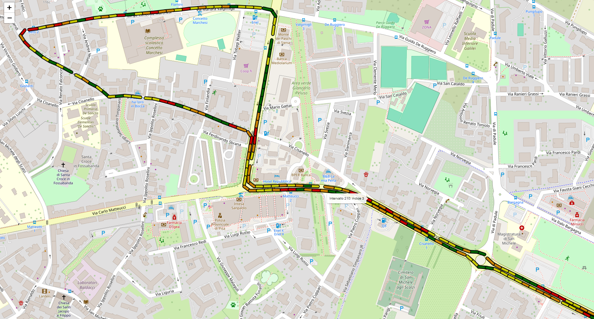

# 📍 Progetto ARTES 4.0 - NOMADIA

## 🧠 Descrizione del Progetto

**NOMADIA** è un progetto sviluppato con l’obiettivo di realizzare un sistema intelligente, mobile e low-cost per il monitoraggio dello stato di usura delle pavimentazioni stradali.

Il sistema è basato su:
- Sensori MEMS (Micro-Electro-Mechanical Systems)
- Videocamere
- Reti neurali e tecniche di **Intelligenza Artificiale (AI)**

L’obiettivo è **riconoscere automaticamente ammaloramenti dell’asfalto** (fessurazioni, buche, deterioramenti) attraverso un'analisi integrata dei dati acustici e visivi raccolti durante il normale transito di veicoli.

## 🎯 Obiettivi Principali

- **Monitoraggio continuo e automatizzato** delle condizioni stradali.
- **Riduzione dei costi e dei disagi** legati agli interventi manutentivi non necessari.
- **Aumento della sicurezza stradale** e riduzione dell’esposizione al rumore.
- **Ottimizzazione delle risorse pubbliche** e supporto alla pianificazione preventiva.
- Migliore **sostenibilità ambientale ed economica**.

## 🛠️ Funzionamento del Sistema

1. Il sistema viene installato su un veicolo (es. mezzo comunale, bus, veicolo di servizio).
2. Durante la marcia, vengono registrati:
   - **Dati acustici** all’interno del pneumatico (tramite microfoni MEMS),
   - **Video della pavimentazione** stradale.
3. I dati vengono elaborati in locale tramite modelli AI.
4. Gli ammaloramenti vengono **identificati, classificati e georeferenziati**.
5. Si genera così un indice che descrive lo stado di deterioramento dei vari tratti di strada analizzati.
6. I risultati sono mostrati su una mappa come quella in figura qui sotto in cui a ciascun colore corrisponde un indice del degrado stradale.
 


## ⚙️ Tecnologie Utilizzate

- **Sensoristica integrata** (microfoni MEMS, videocamere)
- **AI & Machine Learning**:
  - Reti neurali convoluzionali per l’analisi visiva
  - Modelli acustici per la classificazione dei danni
- **Elaborazione dati** su edge e cloud
- **Georeferenziazione** dei dati raccolti (sistemi GIS)
- **Piattaforma di visualizzazione** e reporting per i gestori dell’infrastruttura

## 🗃️ Struttura del Progetto

La struttura del progetto è la seguente:
ARTES.4.0-NOMADIA/

├── README.md        # Descrizione generale del progetto

├── docs/                    # Documentazione tecnica e manuali 

├── results/                 # Esempio di risultati 

├── data/                    # Esempio dati acquisiti (per categoria) 

│   ├── gps                   # esempio dati gps raccolti (per intervalli 20m) 

│   ├── tcn                   # esempio dati audio raccolti (interpolati) 

│   ├── video.txt             # link video esempio 

├── src/                     # Codice sorgente (modelli AI, algoritmi di analisi)

│   ├── audio               # Raccolta dati e analisi acustica 

│   ├── video               # Elaborazione video e riconoscimento visivo


## 📋 Requisiti Tecnici

Le dipendenze principali sono contenute rispettivamente nei file requirements.txt di ciascuna cartella (audio e video).

Le dipendenze principali risultano essere:
  - **Python 3.9+**
  - `TensorFlow` o `PyTorch`
  - `OpenCV`
  - `NumPy`, `Pandas`
  - `scikit-learn`
  - `matplotlib`, `seaborn`
  - `geopandas` (per la mappatura georeferenziata)
- Sistema con supporto per:
  - Microfoni MEMS (inserito su modulo ESP32)
  - Videocamera
  - GPS

NOTA: si consiglia di utilizzare due ambienti virtuali una per la parte audio ed una per la parte video

Ad esempio per creare l'ambiente audio, utilizzare il seguente comando:

```bash
python -m venv nome_ambiente_audio
```
per attivarlo digitare:
```bash
source nome_ambiente_audio/bin/activate
```
successivamente, installare i requisiti necessari
```bash
pip install -r requirements_audio.txt
```
una volta creato, per disattivarlo, digitare:
```bash
deactivate
```
Ripetere gli step di creazione, attivazione e installazione anche per la parte video

## 📋 Esecuzione misura
Come prima cosa attivare l'apposito ambiente virtuale appena creato
```bash
source nome_ambiente_audio/bin/activate
```

Dopodiché verificare che tutti gli strumenti siano connessi con la scheda di elaborazione ed
eseguire il codice di raccolta dati con il comando:
```bash
python src/audio/main.py
```
Per interrompere la misura basta premere il tasto "ENTER".  

Al termine il risultato dell'acquisizione sarà salvato all'interno di apposite cartelle, per i dati audio (interpolati) e per i dati gps (suddivisi in intervalli da 20m). 

Per quanto riguarda il video acquisito della GoPro, si può scegliere la metodologia preferita per scaricarlo (wifi, cavo, sd). Si consiglia il salvataggio in una cartella di facile accesso (es: data).

## 📋 Elaborazione misura
Al fine di analizzare coerentemente i dati raccolti e preprocessati durante la fase di misura è necessario procedere per step: iniziando con l'analisi della componente acustica (al fine di produrre una prima classificazione), per poi concludere con la parte visiva per ottenere l'indice finale su ciascun tratto.

### PARTE AUDIO
Per effettuare l'analisi audio è prima necessario disattivare l'ambiente virtuale mediante il comando
```bash
deactivate
```
è poi sufficiente eseguire il codice:
```bash
python src/audio/Classificazione_tcn.py
```
assicurandosi di scegliere il fit più adatto alla misura in analisi (urbana, extraurbana o autostradale) decommentando la riga appropriata (37-39).

### PARTE VIDEO
Sia **path_video** il percorso alla cartella contenente il/i video registrati durante l'esecuzione della misura; e **path_indice_audio** il percorso al file csv risultante dall'analisi audio appena svolta.

Per eseguire l'analisi video è sufficiente indicare tali percorsi all'interno del file **src/video/main.py** (rispettivamente righe 9 e 22) e lanciare il codice:
```bash
python src/video/main.py
```

## 📋 Output Previsti
Il risultato verrà salvato nella cartella di lavoro sottoforma di:

- Segmentazione visiva dei danni (immagini e labels derivanti dall'esecuzione del modello) 
- Mappa georeferenziata degli intervalli (20m) analizzati (formato html)
- Classificazione dello stato della pavimentazione in base ad un indice audio-video personalizzato (file csv)
