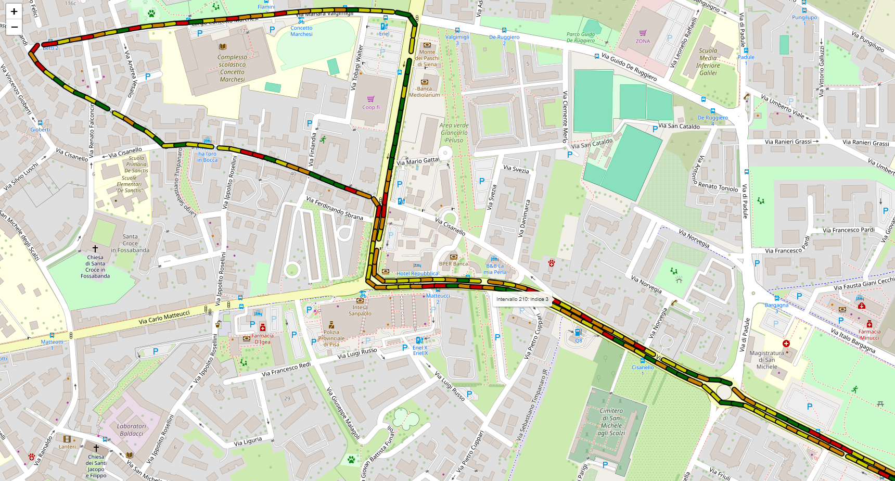

# 📍 Progetto ARTES 4.0 - NOMADIA

## 🧠 Descrizione del Progetto

**NOMADIA** è un progetto sviluppato con l’obiettivo di realizzare un sistema intelligente, mobile e low-cost per il monitoraggio dello stato di usura delle pavimentazioni stradali.

Il sistema è basato su:
- Sensori MEMS (Micro-Electro-Mechanical Systems)
- Videocamere
- Reti neurali e tecniche di **Intelligenza Artificiale (AI)**

L’obiettivo è **riconoscere automaticamente ammaloramenti dell’asfalto** (fessurazioni, buche, deterioramenti) attraverso un'analisi integrata dei dati acustici e visivi raccolti durante il normale transito di veicoli.

## 🎯 Obiettivi Principali

- **Monitoraggio continuo e automatizzato** delle condizioni stradali.
- **Riduzione dei costi e dei disagi** legati agli interventi manutentivi non necessari.
- **Aumento della sicurezza stradale** e riduzione dell’esposizione al rumore.
- **Ottimizzazione delle risorse pubbliche** e supporto alla pianificazione preventiva.
- Migliore **sostenibilità ambientale ed economica**.

## 🛠️ Funzionamento del Sistema

1. Il sistema viene installato su un veicolo (es. mezzo comunale, bus, veicolo di servizio).
2. Durante la marcia, vengono registrati:
   - **Dati acustici** all’interno del pneumatico (tramite microfoni MEMS),
   - **Video della pavimentazione** stradale.
3. I dati vengono elaborati in locale tramite modelli AI.
4. Gli ammaloramenti vengono **identificati, classificati e georeferenziati**.
5. Si genera così un indice che descrive lo stado di deterioramento dei vari tratti di strada analizzati.
6. I risultati sono mostrati su una mappa come quella in figura qui sotto in cui a ciascun colore corrisponde un indice del degrado stradale.
 


## ⚙️ Tecnologie Utilizzate

- **Sensoristica integrata** (microfoni MEMS, videocamere)
- **AI & Machine Learning**:
  - Reti neurali convoluzionali per l’analisi visiva
  - Modelli acustici per la classificazione dei danni
- **Elaborazione dati** su edge e cloud
- **Georeferenziazione** dei dati raccolti (sistemi GIS)
- **Piattaforma di visualizzazione** e reporting per i gestori dell’infrastruttura

## 🗃️ Struttura del Progetto

La struttura del progetto è la seguente:
ARTES.4.0-NOMADIA/

├── README.md                 # Descrizione generale del progetto

├── results/                  # Esempio di risultati 

├── data/                     # Esempio dati acquisiti (per categoria) 

│   ├── gps                   # esempio dati gps raccolti (per intervalli 20m) 

│   ├── tcn                   # esempio dati audio raccolti (interpolati) 

│   ├── video.txt             # link video esempio 

├── src/                      # Codice sorgente (modelli AI, algoritmi di analisi)

│   ├── audio                 # Raccolta dati e analisi acustica 

│   ├── video                 # Elaborazione video e riconoscimento visivo

│   ├── creazione_setting     # Creazione di ambienti virtuali e cartelle di lavoro

│   ├── script               # Scripts per l'automazione dell'avvio e analisi della misura


## 📋 Requisiti Tecnici

Le dipendenze principali risultano essere:
  - **Python 3.9+**
  - `TensorFlow` o `PyTorch`
  - `OpenCV`
  - `NumPy`, `Pandas`
  - `scikit-learn`
  - `matplotlib`, `seaborn`
  - `geopandas` (per la mappatura georeferenziata)
- Sistema con supporto per:
  - Microfoni MEMS (inserito su modulo ESP32)
  - Videocamera
  - GPS

Per installare tutte le dipendenze necessarie sarà sufficiente mettersi con il terminale nella 
cartella  **src/creazione_setting** ed eseguire:
```bash
chmod +x creazione_setting.sh

./creazione_setting.sh
```
Al termine dell'esecuzione si saranno create due cartelle (nella stessa parent directory di **creazione_setting**): 
**Artes_Audio** e **Artes_Video** contenenti ciascuna il proprio ambiente virtuale.

## 📋 Esecuzione misura
Verificare per prima cosa che tutti gli strumenti (GPS, PINT e GoPro) siano connessi con la scheda di elaborazione ed
entrare con il terminale nella cartella **src/script**, dopodichè attivare e lanciare il codice di raccolta dati con i comandi:
```bash
chmod +x avvio_misura.sh

./avvio_misura.sh
```
Per interrompere la misura basta premere il tasto "ENTER".  

Al termine il risultato dell'acquisizione sarà salvato all'interno di apposite cartelle, per i dati audio (interpolati) e per i dati gps (suddivisi in intervalli da 20m). 

Per quanto riguarda il video acquisito della GoPro, si può scegliere la metodologia preferita per scaricarlo (wifi, cavo, sd). Si consiglia il salvataggio in una cartella di facile accesso (es: data).

## 📋 Elaborazione misura
Una volta completata la fase di misura e salvato il video registrato dalla GoPro, per analizzare le misure sarà sufficiente ricollocarsi con il terminale nella cartella **src/script**
e attivare ed eseguire:
```bash
chmod +x analisi_misura.sh

./analisi_misura.sh
```
Durante l'esecuzione verrà richiesto di scegliere gli input per l'analisi (compreso il fit più adatto alla misura in analisi - urbana, extraurbana o autostradale) e i percorsi per gli output tramite apposite finestre.


## 📋 Output Previsti
Il risultato verrà salvato nella cartella di lavoro sottoforma di:

- Segmentazione visiva dei danni (immagini e labels derivanti dall'esecuzione del modello) 
- Mappa georeferenziata degli intervalli (20m) analizzati (formato html)
- Classificazione dello stato della pavimentazione in base ad un indice audio-video personalizzato (file csv)
